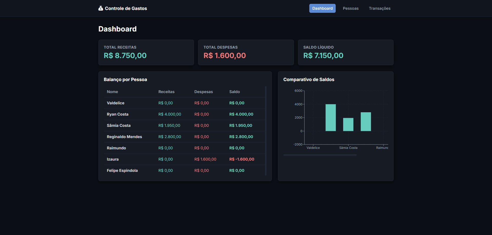
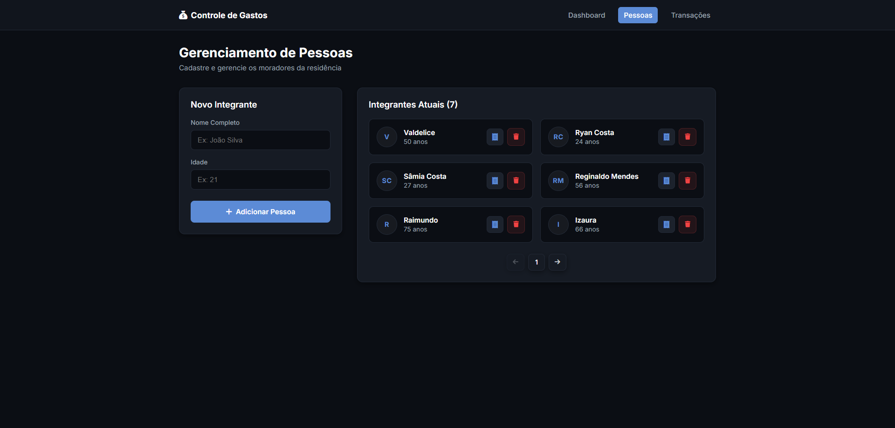
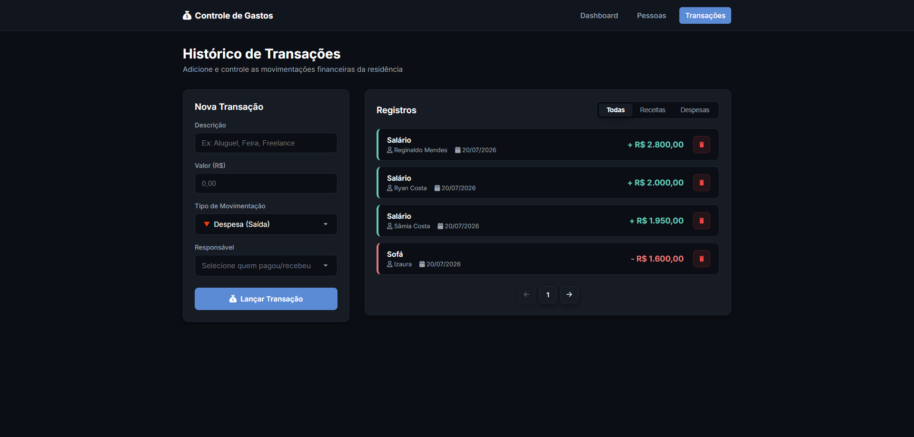
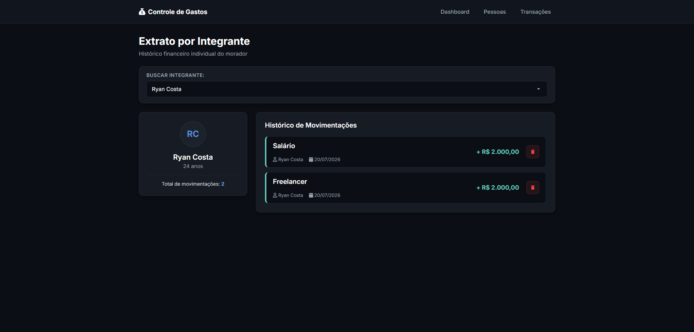

# Controle de Gastos Residenciais

Sistema web full-stack desenvolvido para o gerenciamento de despesas e receitas residenciais.

A aplicação permite cadastrar moradores, registrar movimentações financeiras, aplicar regras de negócio e acompanhar o balanço financeiro da residência de forma individual e consolidada.

O projeto foi desenvolvido utilizando **.NET 8** no back-end e **React + TypeScript** no front-end, priorizando organização do código, separação de responsabilidades, tipagem estática e boas práticas de desenvolvimento.

---

# Demonstração

### Dashboard


### Gerenciamento de Pessoas


### Cadastro de Transações


### Extrato por Integrante


---

# Regras de Negócio Implementadas

- Cada pessoa possui um identificador (GUID) gerado automaticamente.
- Toda transação deve estar vinculada a uma pessoa previamente cadastrada.
- Pessoas menores de 18 anos podem registrar **apenas despesas**.
- Ao excluir uma pessoa, todas as suas transações são removidas automaticamente (deleção em cascata).

---

# Funcionalidades

## Gerenciamento de Pessoas

- Cadastro de pessoas contendo:
  - Nome;
  - Idade;
  - Identificador único gerado automaticamente.
- Listagem de todos os integrantes cadastrados.
- Exclusão de pessoas.
- Remoção automática das transações vinculadas ao excluir uma pessoa.

## Gerenciamento de Transações

- Cadastro de receitas e despesas.
- Associação obrigatória entre transação e pessoa cadastrada.
- Validação da regra de menor de idade diretamente no back-end.
- Listagem completa das movimentações financeiras.

## Dashboard e Consulta de Totais

- Total de receitas por integrante.
- Total de despesas por integrante.
- Saldo individual.
- Totais gerais da residência.
- Gráfico comparativo do saldo de cada integrante.

---

# Documentação da API

A API possui documentação interativa gerada através do **Swagger/OpenAPI**, permitindo visualizar e testar todos os endpoints diretamente pelo navegador.

Após iniciar o back-end, acesse:

```text
http://localhost:5000/swagger
```

> A porta pode variar conforme a configuração da aplicação.

---

# Endpoints

## Pessoas (`/api/people`)

| Método | Endpoint | Descrição |
|---------|----------|-----------|
| GET | `/api/people` | Lista todas as pessoas cadastradas |
| GET | `/api/people/{id}` | Busca uma pessoa pelo ID |
| POST | `/api/people` | Cadastra uma nova pessoa |
| DELETE | `/api/people/{id}` | Remove uma pessoa e todas as suas transações |
| GET | `/api/people/dashboard` | Retorna o resumo financeiro da residência |

## Transações (`/api/transactions`)

| Método | Endpoint | Descrição |
|---------|----------|-----------|
| GET | `/api/transactions` | Lista todas as transações |
| GET | `/api/transactions/{id}` | Busca uma transação pelo ID |
| GET | `/api/transactions/person/{personId}` | Lista as transações de uma pessoa |
| POST | `/api/transactions` | Cadastra uma nova transação |
| DELETE | `/api/transactions/{id}` | Remove uma transação |

---

# Tecnologias Utilizadas

| Back-end | Front-end | Banco de Dados |
|----------|-----------|----------------|
| .NET 8 | React | SQLite |
| C# | TypeScript | Entity Framework Core |
| Entity Framework Core | React Router DOM | |
| LINQ | CSS Modules | |
| Swagger / OpenAPI | Recharts | |

---

# Como Executar o Projeto

## Pré-requisitos

- .NET SDK 8 ou superior
- Node.js 18 ou superior

---

## 1. Executando o Back-end

```bash
cd backend

dotnet restore

dotnet ef database update

dotnet run
```

A API ficará disponível em:

```text
http://localhost:5236
```

Swagger:

```text
http://localhost:5236/swagger
```

---

## 2. Executando o Front-end

```bash
cd frontend

npm install

npm run dev
```

Após iniciar o Vite, acesse:

```text
http://localhost:5173
```

---

# Critérios do Desafio Atendidos

- ✔ Cadastro de pessoas.
- ✔ Cadastro de transações.
- ✔ Persistência dos dados.
- ✔ Exclusão em cascata.
- ✔ Validação para menores de idade.
- ✔ Consulta de totais individuais.
- ✔ Consulta do total geral.
- ✔ Documentação da API com Swagger.
- ✔ Código organizado e comentado.
- ✔ Interface web desenvolvida em React + TypeScript.

---

## Licença

Este projeto foi desenvolvido exclusivamente para fins de avaliação técnica.
